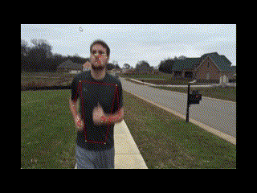
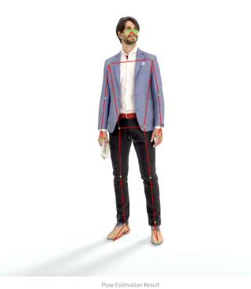

# Human Pose Estimation System 🧍‍♂️

This project is a **Human Pose Estimation System** built using **MediaPipe**, **OpenCV**, and **Streamlit**. It provides an interactive web interface to detect and visualize human pose landmarks from images, videos, and live webcam feed.

---

## Features ✨

- **Image Pose Estimation:** 📸 Upload an image and detect human pose landmarks.
- **Video Pose Estimation:** 🎥 Upload a video file and process it frame-by-frame to visualize pose landmarks.
- **Live Camera Pose Estimation:** 📹 Real-time pose detection using your webcam.
- Visualizes pose landmarks with colored lines and points for clear skeleton representation. 🦴
- Simple and user-friendly Streamlit web app interface. 🚀

---

## Demo Output 📺

---

## Getting Started 🚀

### Prerequisites

- Python 3.12 (recommended) 🐍
- pip (Python package manager) 📦

### Try it out 👇

[Link to app] 🌐

### Project Structure 📂

- `estimation_app.py` — Main Streamlit application file 🖥️
- `pose_estimation_image.py` — Pose estimation logic for images (optional modular script) 🖼️
- `pose_estimation_video.py` — Pose estimation logic for videos (optional modular script) 🎞️
- `run.jpg`, `run1.mp4` — Sample media files (optional) 🏃‍♀️
- `README.md` — This documentation file 📝

### How It Works 🧠

- Uses MediaPipe's Pose solution to detect 33 body landmarks per person. 📌
- Processes the input (image, video, or webcam frames) with MediaPipe. ⚙️
- Draws landmarks and connections on the image/video frames using OpenCV. 🎨
- Displays the processed media with Streamlit's easy-to-use web interface. 💡

### Technologies Used 🛠️

- MediaPipe — State-of-the-art pose detection. 🌟
- OpenCV — Image and video processing. 📷
- Streamlit — Web app framework for interactive ML demos. 📊
- Python 3.12 — Latest recommended Python version. ✅
